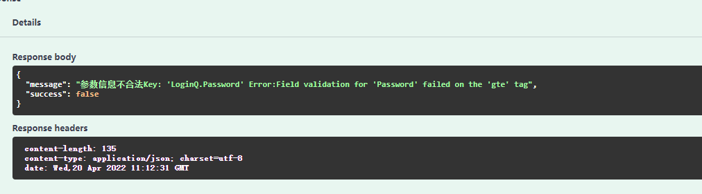

# 第三章：使用bind绑定参数和参数验证


首先举一个不恰当的例子，当某个API具有很多种参数时，例如下面这种。

```c
// AdvancedSelectPaper doc
// @description es 高级检索筛选论文，包括对文章类型journal的筛选，页数的更换,页面大小size的设计, \n 错误码：401 参数格式错误, 排序方式1为默认，2为引用率，3为年份
// @Tags elasticsearch
// @Param conditions formData string true "conditions 为条件，表示字典的列表：type 123表示运算符must or，not，"
// @Param min_date formData string true "min_date"
// @Param max_date formData string true "max_date"
// @Param page formData int true "page"
// @Param size formData int true "size"
// @Param doctypes formData string true "doctypes"
// @Param conferences formData string true "conferences"
// @Param journals formData string true "journals"
// @Param publishers formData string true "publishers"
// @Param sort_type formData int true "sort_type"
// @Param sort_ascending formData bool true "sort_ascending"
// @Success 200 {string} string "{"success": true, "message": "获取成功"}"
// @Failure 500 {string} string "{"success": false, "message": "错误500"}"
// @Router /es/select/paper/advanced [POST]
```

若你对每一个参数在注释时都一条条的注释，并且才取参数的时候也一条一条的取，例如`page_str := c.Request.FormValue("page")`， 此时显然是一段很臭并且不利于编写的代码。此外，大多数情况，参数还存在着非法情况，当遇到如此多的参数，并且若是存在着参数格式不正确，自然也不能一条条的`if-else` 的验证。在Django中，有着Form的处理方式，而在Gin中则是有`bind-data`来验证数据，并有`validator` 来对指定字段值进行验证。

## bind-data basic

相对应在刚刚介绍的Swagger中，使用如下方式来传递一组参数，上一戒中也介绍过，`model.LoginQ`自行定义在model包中，此时Swagger注释便美观多了。

```c
// @Param        data  body      model.LoginQ  true  "用户名，密码"
```

其中LoginQ内容如下

```go
type LoginQ struct {
	Username string `json:"username"`
	Password string `json:"password"`
}
```


基本使用方式见下，创建data LoginQ类型，使用ShouldBindJson方法将json格式的信息按照LoginQ转化到data中。

PS：若传输的信息中含有非Json信息，请使用`ShouldBind` ，而BindJson、Bind与ShouldBindJson、ShouldBind的区别则是是否返回错误信息以供调试。个人建议使用Should。

```go
	var data model.LoginQ
	if err := c.ShouldBindJSON(&data); err != nil {
		panic(err)
	}
```

当然若是每次传递参数都使用如上三行来套模板也有些“臭”。下面简单封装一下上述代码，在`utils/gin.go` 中添加如下代码.(`utils` 在我的理解中可以存放一些工具类的函数)

首先先放置一个简单版，尽可对Json进行判断并不返回错误信息。

```go
func BindAndValid(c *gin.Context, model interface{}) interface{} {
	if err := c.ShouldBindJSON(&model); err != nil {
		_, file, line, _ := runtime.Caller(1)
		panic(file + "(line " + strconv.Itoa(line) + "): bind model error")
	}
	return model
}
```

而在原来的获取参数部分，则可直接获取

```go
data := utils.BindAndValid(c, &model.LoginQ{}).(*model.LoginQ)
```

随后使用`data.username` 即可调用。


## validator

[开源项目](https://github.com/go-playground/validator)`go-playground/validator`是一个基于标签对结构体和字段进行值验证的验证器， 我们依此来作为参数校验。

获取方式

```go
go get github.com/go-playground/validator/v10
```

下面给出部分常用的标签，具体使用仍需查看[官网文档](https://github.com/go-playground/validator)，更详细的中文使用参见[url](https://juejin.cn/post/6847902214279659533)

| 标签     | 含义                      |
| -------- | ------------------------- |
| required | 必填                      |
| gt       | 大于                      |
| gte      | 大于等于                  |
| lt       | 小于                      |
| lte      | 小于等于                  |
| min      | 最小值                    |
| max      | 最大值                    |
| oneof    | 参数集内的其中之一        |
| len      | 长度要求与 len 给定的一致 |


于是我们对LoginQ进行修改，增加了binding 其中username表示长度3-100，必填，而password表示长度大于等于6必填

```go
type LoginQ struct {
	Username string `json:"username" binding:"min=3,max=100,required"`
	Password string `json:"password" binding:"gte=6,required"`
}
```

注：由于gin内置了validator v10于是使用binding，正常应使用：`validator:required`

并修改原函数。以及更改ShouldBindAndValid函数，让其当验证错误时返回错误信息。

```go
func ShouldBindAndValid(c *gin.Context, model interface{}) error {
	if err := c.ShouldBind(&model); err != nil {
		return err
	}
	return nil
}

```

```go
func Login(c *gin.Context) {

	var data model.LoginQ{}
	if err := utils.ShouldBindAndValid(c, &data);err != nil {
		c.JSON(http.StatusOK, gin.H{
			"success": false,
			"message": "参数信息不合法" + err.Error(),
		})
		return
	}

	c.JSON(http.StatusOK, gin.H{
		"success": true,
		"message": "登录成功",
		"data":    "username:" + data.(*model.LoginQ).Username + ",password:" + data.(*model.LoginQ).Password,
	})
}

```


当输入格式不规范时,该接口返回信息：

```json
{
  "password": "st",
  "username": "string"
}
	
Response body
{
  "message": "参数信息不合法Key: 'LoginQ.Password' Error:Field validation for 'Password' failed on the 'gte' tag",
  "success": false
}
```




PS 可在ShoudBindAndValid 中添加翻译器使其翻译成中文报错，读者可自行尝试。


## 结语

本小节简单介绍了bind-data，以及验证器go validator的使用方法并给出了简单实例。相信聪明的你肯定学会了吧。

## 参考

1. [Go 使用validator进行后端数据校验](https://juejin.cn/post/6847902214279659533)
2. [go validator](https://github.com/go-playground/validator)
