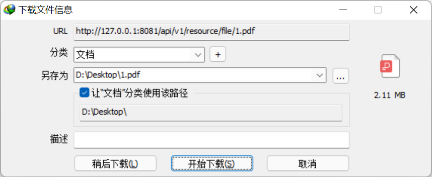
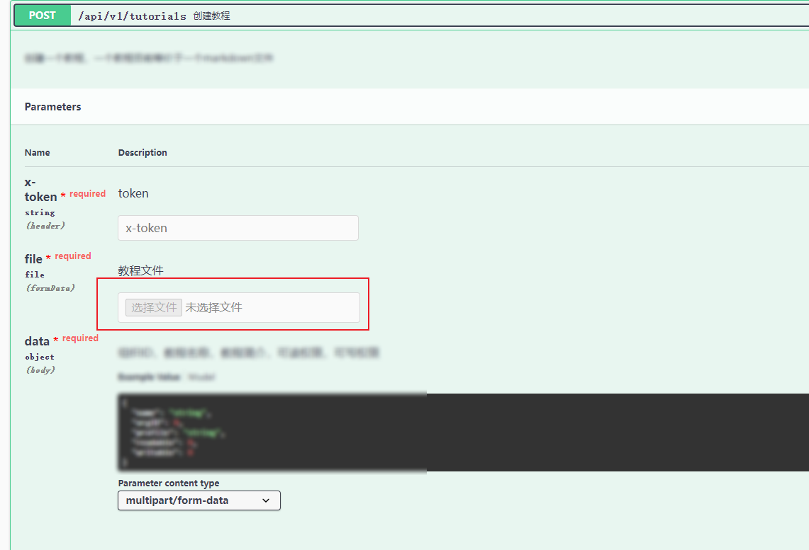
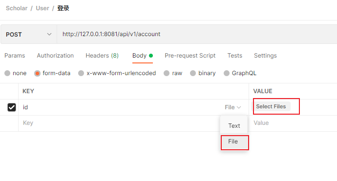

# 第四章：gin对于文件的上传和返回

​	文件的上传与下载对于一个网站来说往往十分必要的，例如用户头像或者其他文件的上传等等。而此处的处理方法便是当前端将文件传给后端时，后端对文件进行保存到特定的位置中。随后根据路由设置，对这些文件以某个url供外访问，当然也可交给前端访问了。 当然后端也可对路由进行设置，保证某些路由被访问时需要一定的信息，这样就可以保证一定的安全性了。（不过也是后话了。

​	于是本节主要分为两个小部分，即文件的上传与返回。

// TODO	参考代码可见`api/v1/file.go` 中


## 文件上传

下面给了一部分代码，供参考

```go
// CreateTutorial
// @Summary      创建教程
// @Description  创建一个教程，一个教程目前等价于一个markdown文件
// @Tags         教程模块
// @Accept       multipart/form-data
// @Produce      json
// @Param        x-token  header    string                  true  "token"
// @Param        file     formData  file                   true  "教程文件"
// @Param        data     body      model.CreateTutorialQ  true  "组织ID，教程名称，教程简介，可读权限，可写权限"
// @Success      200      {object}  model.CommonA          "是否成功，返回信息"
// @Router       /api/v1/tutorials [post]
func CreateTutorial(c *gin.Context) {
	// 获取请求数据
	var data model.CreateTutorialQ
	if err := c.ShouldBind(&data); err != nil {
		c.JSON(http.StatusOK, model.CommonA{Success: false, Message: "请求参数非法"})
		return
	}
	// 新建教程
	tutorial := model.Tutorial{Name:      data.Name,}
	if err := service.SaveTutorial(&tutorial); err != nil {
		c.JSON(http.StatusOK, model.CommonA{Success: false, Message: "创建教程失败"})
		return
	}
    if err := c.SaveUploadedFile(data.File, thePath )); err != nil {
		// 回滚数据库
		_ = service.DeleteTutorialByID(tutorial.ID)
		global.LOG.Panic(err)
	}
	c.JSON(http.StatusOK, model.CommonA{Success: true, Message: "创建教程成功"})
}
```


在主函数25行上，使用`c.SaveUploadedFile` 来保存文件，其中`data.File` 便是前端所传来的文件了，而后面的参数也是文件的具体保存路径。也即是上文所说的特定位置。 若是err为空则是保存成功，否则保存失败，本API中在21行创建了`tutorial` 的数据库表项。若是发生了文件错误，此处认为保存失败，也是删除对应的数据库表项。


实际使用中也可对文件的最大空间、允许文件的后缀等多个方面去限制文件上传，此处不多做演示了。

以上便是完成了文件的上传部分。那么要怎么找到对应的文件呢，此处的解决办法是利用路由设置，对指定的文件夹内文件可被特定的url所访问到。 当前端访问特定的url时，或可通过后端的验证便可访问到指定文件了。（具体限制在中间件部分细说）


## 文件返回

路由规则如下

```go
resourceRouter := basicRouter.Group("/resource"){
    resourceRouter.Static("/image",imagePath )
}
```

第一行代表对路由进行分组，而下面则是控制指定路由对url的访问了。其中参数1便是路由、参数2便是保存位置了。个人大多直接指定绝对地址进行保存。

```go
rootPath, err := os.Executable()
if err != nil {
   panic("初始化失败：可执行程序路径获取失败")
}
rootPath = filepath.Dir(rootPath)
imagePath := filepath.Join(rootPath, "resource", "image")
```

保存成功后，若`resourceRouter` 的路由为`127.0.0.1:8081/api/v1/resource` ，则可通过`127.0.0.1:8081/api/v1/resource/image`+文件名访问到指定文件了。

而后端则可以在返回json中给明特定文件的url即可。下图为我上传了一个`1.pdf` 文件，当访问指定路由url时，IDM提示我下载该文件。



## 其他

在本地测试时，个人目前所知两种相对方便的做法

1. 在swagger中配置`// @Param        file     formData  file       true  "教程文件"` 的注释，便可在swagger中上传文件

   

2. 使用postman的formData中选择File模式即可

   


# 推荐教程

1. 官方文档 https://gin-gonic.com/zh-cn/docs/examples/upload-file/


<script src="https://utteranc.es/client.js"
        repo="Super-BUAA-2021/GinBook"
        issue-term="pathname"
        theme="github-light"
        crossorigin="anonymous"
        async>
</script>