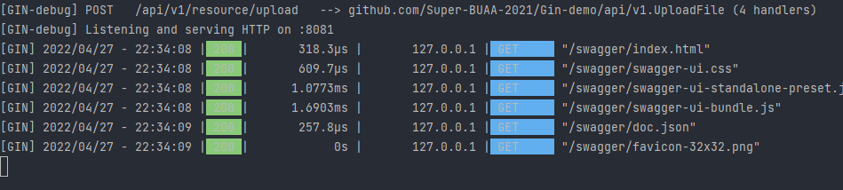
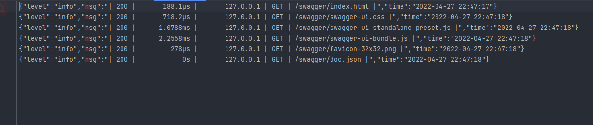

# 第六章 日志介绍以及工具推荐


当项目部署到服务器上运行时，很有可能出现后端在某次服务中出现了问题。但是我们若不是用户告知恐怕很难发现这个错误。这时便需要日志的出场了。由日志为我们记下访问的信息以供后续调试。


当然Gin自带了Logger可以在控制台上输出一些访问以及异常记录。当运行后便后下图所示结果




但是其只能显示在shell中却不能记录下来。而本例中将会使用Logrus来作为中间件记录日志。

在`middleware/logrus.go` 中添加如下代码，并使用此中间件，

即在`router/router.go` 中添加`r.Use(middleware.LoggerToFile())`  

```go
func LoggerToFile() gin.HandlerFunc {
	logFilePath := global.VP.GetString("root_path")
	logFileName := "demo.log"
	//日志文件
	fileName := path.Join(logFilePath, logFileName)
	//写入文件
	src, err := os.OpenFile(fileName, os.O_WRONLY|os.O_CREATE|os.O_APPEND|os.O_SYNC, 0666)
	if err != nil {
		fmt.Println("err", err)
	}
	//实例化
	logger := logrus.New()
	//设置输出
	logger.Out = src
	//设置日志级别
	logger.SetLevel(logrus.DebugLevel)
	//设置日志格式
   	logger.SetFormatter(&logrus.JSONFormatter{    
        TimestampFormat:"2006-01-02 15:04:05",    
    })
	return func(c *gin.Context) {
		// 开始时间
		startTime := time.Now()
		// 处理请求
		c.Next()
		// 结束时间
		endTime := time.Now()
		// 执行时间
		latencyTime := endTime.Sub(startTime)
		// 请求方式
		reqMethod := c.Request.Method
		// 请求路由
		reqUri := c.Request.RequestURI
		// 状态码
		statusCode := c.Writer.Status()
		// 请求IP
		clientIP := c.ClientIP()
		// 日志格式
		logger.Infof("| %3d | %13v | %15s | %s | %s |",
			statusCode,
			latencyTime,
			clientIP,
			reqMethod,
			reqUri,
		)
	}
}
// from https://www.mianshigee.com/note/detail/225516exd/
```

为了方便使用者读取我将其改为了json格式，随后访问swagger界面，可在`demo.log`见到如下日志



随后我又根据参考在log上更改了一些，具体请见`Gin-Demo/middleware/logrus.go` 中。

不过由于使用了`gin.Default()` 导致目前无法捕获异常放置到日志中，而是随着默认Recovery输出到了终端上。后续会介绍如何使用中间件捕获异常。


# 参考

1. [go-gin-api-document](https://github.com/xinliangnote/Go/blob/master/03-go-gin-api%20%5B%E6%96%87%E6%A1%A3%5D/03-%5Bgo-gin-api%5D%20%E8%B7%AF%E7%94%B1%E4%B8%AD%E9%97%B4%E4%BB%B6%20-%20%E6%97%A5%E5%BF%97%E8%AE%B0%E5%BD%95.md)
2. https://github.com/xinliangnote/go-gin-api
