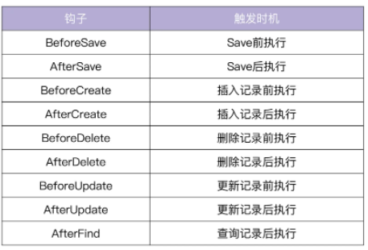

# 第七章：初识GROM使用GORM进行数据库操作

ORM（对象关系一行社）可以在关系型数据库与对象之间建立映射，可以想操纵对象一样操作数据库。而在Go中，我所指的有Gorm与Beego ORM两种ORM库用一操作数据库。而本Book中选择Gorm。

### 为什么选择Gorm

Gorm是Go语言中的一个性能较好的ORM库。对开发人员友好，功能强大，调用方便。许多大厂都在使用[1]。

此外还有一些特点：

* 支持关联（Has one Has Many….)
* 支持预加载
* 支持Hook（增删改查前后进行操作）
* 支持事务处理。（很重要）


~~不过由于我没用过Beego ORM，就不妄自评论了~~


### Gorm的安装

```
go get -u github.com/gorm.io/gorm
```


## Gorm的具体使用

### 数据库连接

由于Mysql的普遍性，此处以Mysql为例进行数据库连接

首先预定义好特定的字符串，使用如下代码即可连接，在`Gin-demo` 中，使用读取yml文件的方式，来避免敏感信息泄露。

```go
dsn := fmt.Sprintf(`%s:%s@tcp(%s)/%s?charset=utf8&parseTime=%t&loc=%s`,
		username,
		password,
		host,
		database,
		true,
		"Local")
	db, err := gorm.Open(mysql.Open(dsn), &gorm.Config{})
if err != nil {
		panic("failed to connect database")
	}

```


在实际使用数据库中，大致可以归类为一下六种操作[3]

1. **数据库表结构迁移**

   ```go
   	// 1. Auto migration for given models
   	db.AutoMigrate(&Product{})
   ```

   不过该操作也只能对新增的字段进行变更。却不会删除字段

2. **插入数据**

   ```go
   // 2. Insert the value into database
   	if err := db.Create(&Product{Code: "D42", Price: 100}).Error; err != nil {
   		log.Fatalf("Create error: %v", err)
   	}
   	PrintProducts(db)
   ```

   使用`Create` 方法创建记录，通过返回错误检查是否成功插入。

3. **获取某个符合条件的数据**

   ```go
   // 3. Find first record that match given conditions
   	product := &Product{}
   	if err := db.Where("code= ?", "D42").First(&product).Error; err != nil {
   		log.Fatalf("Get product error: %v", err)
   	}
   ```

   使用`First`方法返回符合记录的第一条数据，将返回数据存储于`product`中。

4. **更新数据表项**

   ```go
   // 4. Update value in database, if the value doesn't have primary key, will insert it
   	product.Price = 200
   	if err := db.Save(product).Error; err != nil {
   		log.Fatalf("Update product error: %v", err)
   	}
   	PrintProducts(db)
   ```

   使用`Save`方法，来把变量`product`中所有于数据库中不一样的字段更新到数据库中。此处更新了`Price`并保存到数据库中。

5. **删除某表项**

   ```go
   // 5. Delete value match given conditions
   	if err := db.Where("code = ?", "D42").Delete(&Product{}).Error; err != nil {
   		log.Fatalf("Delete product error: %v", err)
   	}
   	PrintProducts(db)
   ```

   使用`Delete`方法，来把product从对应的数据库表中删除

   不过`gorm`同样支持批量删除，

   `db.Where("name in (?)",[]string{"ceshi","123"}).Delete(&User{})`

6. **获取一系列表记录**

   ```go
   // List products
   func PrintProducts(db *gorm.DB) {
   	products := make([]*Product, 0)
   	var count int64
   	d := db.Where("code like ?", "%D%").Offset(0).Limit(2).Order("id desc").Find(&products).Offset(-1).Limit(-1).Count(&count)
   	if d.Error != nil {
   		log.Fatalf("List products error: %v", d.Error)
   	}
   
   	log.Printf("totalcount: %d", count)
   	for _, product := range products {
   		log.Printf("\tcode: %s, price: %d\n", product.Code, product.Price)
   	}
   }
   ```

   该方法可以获取到一系列的记录，根据`Offset Limit Order`来调整返回顺序等。

​		

## 模型定义

```go
// User 用户
type User struct {
	ID       uint64    `gorm:"primary_key; autoIncrement; not null;" json:"id"`
	Name     string    `gorm:"size:32; not null;" json:"name"`
	Email    string    `gorm:"size:32; not null; unique;" json:"email"`
	Password string    `gorm:"size:128; not null;" json:"password"`
	Avatar   string    `json:"avatar"`
	Profile  string    `gorm:"size:256;" json:"profile"`
	RegTime  time.Time `gorm:"autoCreateTime" json:"regTime"`
    UpdatedAt time.Time `gorm:"autoUpdateTime; not null;" json:"updatedAt"`
}

```

在模型定义后，随后使用`db.AutoMigrate(&User{})`  后运行，即可将生成表到数据库中。在`Gin-demo` 项目中则位于`initialize/gorm.go`中。

此处只是做一个简单实例，并不介绍大多情况。实际使用时可参照此或者其他项目亦或是官方文档来使用。

## 高级查询

此处介绍四种高级检索

1. 对检索记录进行排序

   ```go
   // SELECT * FROM users ORDER BY age desc, name;
   db.Order("age desc, name").Find(&users)
   ```

2. Limit & Offset

   Offset 指定从第几条记录开始查询，Limit 指定返回的最大记录数。Offset 和 Limit 值为 -1 时，消除 Offset 和 Limit 条件。另外，Limit 和 Offset 位置不同，效果也不同。

   ```go
   // SELECT * FROM users OFFSET 5 LIMIT 10;
   db.Limit(10).Offset(5).Find(&users)
   ```

   

3. Distinct 可以从数据库记录中选择不同的值。

   ```go
   db.Distinct("name", "age").Order("name, age desc").Find(&results)
   ```

   

4. Count 可以获取匹配的条数。

   ```go
   var count int64
   // SELECT count(1) FROM users WHERE name = 'jinzhu'; (count)
   db.Model(&User{}).Where("name = ?", "jinzhu").Count(&count)
   ```

   

## 原生SQL查询

基本用法如下，

```go
type Result struct {
  ID   int
  Name string
  Age  int
}

var result Result
db.Raw("SELECT id, name, age FROM users WHERE name = ?", 3).Scan(&result)
```


## Hook

Hook即钩子，下面代码为在插入记录之前的所执行的Hook，` (u *User)` 表示对User结构体的方法

```go
func (u *User) BeforeCreate(db *gorm.DB) (err error) {
  u.UUID = uuid.New()

    if u.Name == "admin" {
        return errors.New("invalid name")
    }
    return
}
```





## 事务处理

Gorm的事务处理也比较简单，使用`db.Begin()` 开启事务，使用`tx.Commit()`方法结束事务。异常时使用`tx.Rollback()`回滚。有如下示例代码

```go
	//开启事务
	tx := db.Begin()
	
	GormUser := GormUser{
		Phone:    "18888888888",
		Name:     "Shirdon",
		Password: md5Password("666666"), //用户密码
	}
	if err := tx.Create(&GormUser).Error; err != nil {
		//事务回滚
		tx.Rollback()
		fmt.Println(err)
	}
	db.First(&GormUser, "phone = ?", "18888888888")
	//事务提交
	tx.Commit()
```


# 总结

Go项目中，本例使用Gorm进行数据库的CURD操作。而Gorm同样也是相对非常受欢迎的ORM框架。本章提供了Gorm的大多数操作方式并包括高级检索、事务处理、Hook等。这三种操作在实际使用中非常有用。不过若是降低要求，只是掌握了CURD基本操作在小型后端上已经可以一试了。


# 参考

1. 极客时间：Go项目开发实战：30

2. [Gorm](https://github.com/go-gorm/gorm)

3. [六种操作源码](https://github.com/marmotedu/gopractise-demo/blob/master/gorm/main.go)

   
