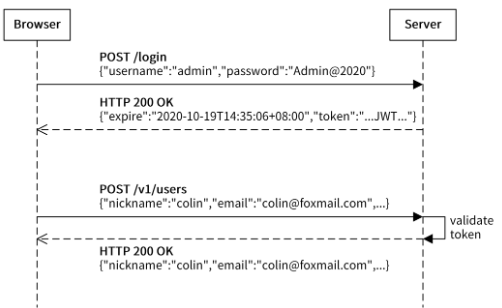

# 第八章 jwt-go详细教学及使用示例

​	在前面的各章学习交流后，相信你已经可以写出一个小型后端了，并在开发服务器上运行起来了。但是我们现在仍存在一个问题，就是这些API接口并没有鉴权功能，即所有知道后端地址的人都可以请求该项目的API接口与Swagger文档。甚至可能被网络的端口扫描器所扫描到而滥用。因此我们需要对API接口进行访问控制。

​	个人所知的API访问控制有两种，`OAuth2.0` 与`JWT` .由于这而这完全不同，此处还是使用更轻量化的JWT来实现API的访问控制功能。


## 什么是JWT

JWT：Json Web Token，用来在各方用Json对象安全的传输信息，并且由于此信息经过了数字签名，因此该信息可以被信任。

`JWT`内部由`.` 分为三部分：`Header Payload Signature` 分别是头部，有效信息，签名。

​	头部介绍令牌类型与使用的签名算法。而`Payload`则是一个Json对象，表示`JWT`中实际传输的数据。在签名中则是对前两个部分进行的签名，从而校验消息在整个过程中是否被篡改，对于私钥签名的令牌，还可以验证JWT的发送者是否是真实身份。

典型的认证过程如下，用户登录后，Server像前端发送指定tokens，前端将其存储在`Cookie`或是`localstorage`中并在后续每次操作都携带Token，Server端收到请求后便会验证Token，进行鉴权，进行业务逻辑处理。



### JWT的安装

```
go get -u github.com/golang-jwt/jwt@latest
```


## JWT的使用

使用如下代码生成一个token，其中jwt.StandardClaims为`jwt-go`中预定义的一些字段，此处只使用两个，并把传来的userid,作为`Audience` 存储。对上述信息使用`SHA256`加密，紧接着利用配置文件中配置的`server.secret` ，来使用`token.SignedString` 方法生成签名字符串。


```go
// GenerateToken 生成一个token
func GenerateToken(id uint64) (signedToken string) {
	claims := jwt.StandardClaims{
		Issuer:   "demo-server",
		Audience: strconv.FormatUint(id, 10),
	}
	token := jwt.NewWithClaims(jwt.SigningMethodHS256, claims)
	secret := global.VP.GetString("server.secret")
	signedToken, err := token.SignedString([]byte(secret))
	if err != nil {
		panic("GenerateToken: sign token error")
	}
	return
}
```

当用户登录时，即可通过上述方法，传入指定用户的id后生成对应的token。由于其中使用了私钥secret，可以保证安全性。

当前端将获取到token后在此发来请求，后端便可对此token进行解析验证。具体代码如下，解析token后获得到某用户的uid，从而得到具体的用户正在使用。

```go
// ParseToken 验证token的正确性，正确则返回id
func ParseToken(signedToken string) (id uint64, err error) {
	secret := global.VP.GetString("server.secret")
	token, err := jwt.Parse(
		signedToken,
		func(token *jwt.Token) (interface{}, error) {
			return []byte(secret), nil
		},
	)
	if err != nil || !token.Valid {
		err = errors.New("token isn't valid")
		return
	}
	id, err = strconv.ParseUint(token.Claims.(jwt.MapClaims)["aud"].(string), 10, 64)
	if err != nil {
		err = errors.New("token isn't valid")
	}
	return
}
```

上述代码位于`Gin-Demo/utils/auth.go`中


## 将JWT应用于中间件中

鉴权若是后端每需要便要调用一次还是比较麻烦的，为此我们将鉴权引入到中间件中，对特定的组路由（`GroupRouter`）应用此中间件，即可对该组路由对应的API接口进行鉴权。

下图为`middleware/auth.go`中的代码，通过提取gin上下文中的头部`x-token`字段,来进行参数验证。若是用户校验失败，则表示前端的token不合法而返回。解析成功后，得到token内部的uid，检测数据库中不存在此用户，同样也是不合法而返回。最终使用`c.Set("user", user)`，将用户结构体放在上下文中。以便后续直接获取到用户。

```go
func AuthRequired() gin.HandlerFunc {
	return func(c *gin.Context) {
		token := c.GetHeader("x-token")
		id, err := utils.ParseToken(token)
		if err != nil {
			c.JSON(http.StatusOK, gin.H{"success": false, "message": "用户校验失败"})
			c.Abort()
			return
		}
		if user, notFound := service.GetUserByID(id); notFound {
			c.JSON(http.StatusOK, gin.H{"success": false, "message": "用户不存在"})
			c.Abort()
		} else {
			`c.Set("user", user)`
		}
	}
}
```

在上述将user放入到上下文后，即可通过此方法在各API中来一步获取到当前用户了。

```go
func SolveUser(c *gin.Context) database.User {
	userRaw, _ := c.Get("user")
	return userRaw.(database.User)
}
user := utils.SolveUser(c)
```


## 参考

1. Matrix53 phoenix server
2. [jwt-go](https://github.com/golang-jwt/jwt)
