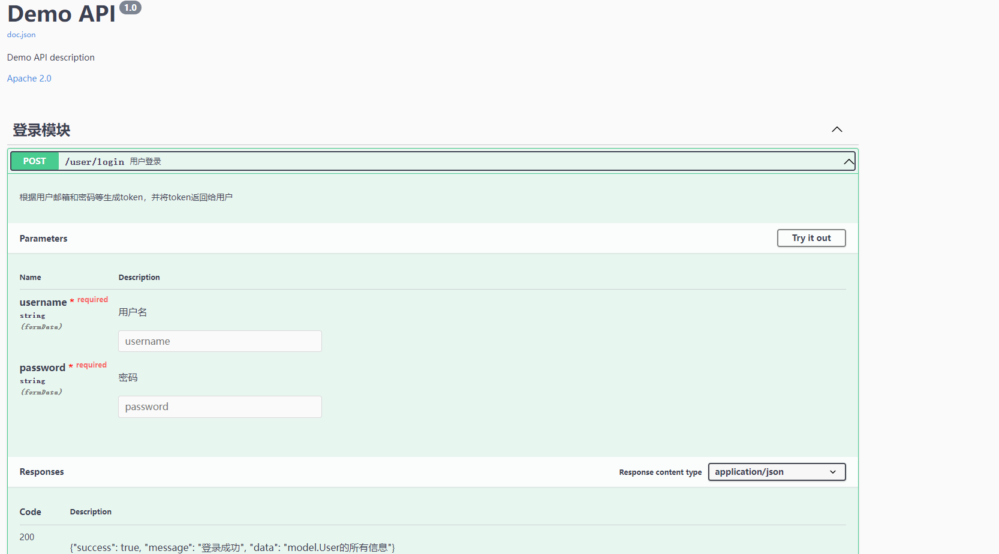

# Swagger 介绍


### swagger 是什么

Swagger 是一个规范且完整的框架，用于生成、描述、调用和可视化 RESTful 风格的 Web 服务。

Swagger 的目标是对 REST API 定义一个标准且和语言无关的接口，可以让人和计算机拥有无须访问源码、文档或网络流量监测就可以发现和理解服务的能力。当通过 Swagger 进行正确定义，用户可以理解远程服务并使用最少实现逻辑与远程服务进行交互。与为底层编程所实现的接口类似，Swagger 消除了调用服务时可能会有的猜测。

#### Swagger 的优势

- 支持 API 自动生成同步的在线文档：使用 Swagger 后可以直接通过代码生成文档，不再需要自己手动编写接口文档了，对程序员来说非常方便，可以节约写文档的时间去学习新技术。
- 提供 Web 页面在线测试 API：光有文档还不够，Swagger 生成的文档还支持在线测试。参数和格式都定好了，直接在界面上输入参数对应的值即可在线测试接口。

### 安装

在此之前仍要确保将GOROOT、GOPATH加入到环境变量。并默认使用的是Go的最新版

官方网址： [swag](https://github.com/swaggo/swag)

```go
 go install github.com/swaggo/swag/cmd/swag@latest
```


### 命令使用

`swag init` 生成swag文档，不加参数的话自动生成到 `./docs` 中，其中的内容全部由swag生成。

`swag fmt` 使用`fmt`格式化 SWAG 注释。(请先升级到最新版本)


主要使用以上两个就可以了，更具体使用也可参见官方中文[README](https://github.com/swaggo/swag/blob/master/README_zh-CN.md)


### 具体使用

由于在`initialize/router`中导入swagger 并注册了一下路由后，运行gin-demo 即可在`127.0.0.1:8081/swagger` 访问到swagger文档了。

```go
import （ginSwagger "github.com/swaggo/gin-swagger"
	_ "github.com/Super-BUAA-2021/Gin-demo/docs"） // 重要
r.GET("/swagger/*any", ginSwagger.WrapHandler(swaggerFiles.Handler))
```

当然在需要添加swagger的api接口上方添加指定格式的注释。再使用`swag init` 生成文档重新运行即可。



前端或后端可直接通过此界面来想指定位置发送请求以测试。

