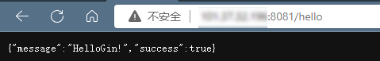
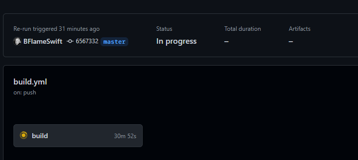

# 利用Github Action 自动部署Go项目

## 简介

Github 针对开发者提供了很多免费的实用工具，Github Action 就是其中之一。你可以将其理解为一个特殊的脚本，在满足一定条件的时候它就会执行（例如检测到对某一分支的push，到达了一天的0点等）。

在网站开发中，后端经常需要把刚写完的内容同步至服务器端供前端测试，如果手动部署，则需要先连接服务器，然后`git pull`，再将后端运行起来。一次两次还好，多了之后会很浪费时间且比较枯燥。适当使用 Github Action 就可以把这个过程自动化，下面将介绍如何实现自动部署。

而由于本人的生疏不足，因此此处介绍两种常用的方法进行自动化部署。第一种较为常见，类似[DjangoBook-GithubAction](https://super-buaa-2021.github.io/Djangobook/post/ch3/3.html) 的部署方案，另一种则是使用Go的工具Air来对Go项目进行热加载，即自动编译、重启程序，也可以达到自动部署的作用。


##  Github Action自动部署

​	

### 准备工作

事实上，Go项目（此处以一Gin项目为例）的部署，就是在服务器上关掉之前的后端服务，并重新打包`go build main.go` 并运行项目`./main &`  即可。不过在自动化部署中，需要做到登录到服务器，并执行相应命令。

个人目前的`.github/workflows/build.yml` 内容如下：

```yaml
name: build

on:
  push:
    branches: [master]

jobs:
  build:
    runs-on: ubuntu-latest

    steps:
      - name: setup
        run: sudo apt install sshpass

      - name: pull and build
        env:
          GO: /usr/local/go/bin/go

        run: |
          sshpass -p ${{secrets.PASSWORD}} ssh -o StrictHostKeyChecking=no root@${{secrets.IP}} "cd /opt/Project/Gin-demo; git config --global http.postBuffer 1048576000;git pull; make kill;    make dep;   ps -ef | grep Gin-demo; ls ./scripts/; nohup make build_and_run"
```

上面具体做了几件事：	

1. 登录到服务器
2. pull仓库
3. kill之前运行的程序`make kill`
4. build-and-run `make build_and_run`

而将一些命令简化为`make + *`的格式，还是使用了`Makefile`，个人的配置如下：

```makefile
BINARY_NAME=Gin-demo
# Github-action中指定go路径并使用更稳定
GO=/usr/local/go/bin/go

build:
	GOARCH=amd64 GOOS=linux ${GO} build -o ${BINARY_NAME}-linux main.go

# 根据文件名查找相应进程并kill
kill:
	ps -ef | grep ${BINARY_NAME} | grep -v grep | awk '{print $2}' | xargs kill -9

run:
	./${BINARY_NAME}-linux

build_and_run: build run

clean:
	${GO} clean
	rm ${BINARY_NAME}-linux


test:
	${GO} test ./...

test_coverage:
	${GO} test ./... -coverprofile=coverage.out

# 更新包
dep:
	${GO} mod tidy

vet:
	${GO} vet

lint:
	golangci-lint run --enable-all
```

有了Makefile便可在开发中节省不少力气以及加快开发进程，具体的Makefile使用可以去[1]中查看。


然而之所以有第二种方法，还是因为这种流程下来，会导致运行后端`./Gin-demo`后，workflow 无法直接结束：等到Gin-demo结束。即便已经完成了一系列的操作，当然后端也已成功部署。在此也希望后续有人或是我自己能发现问题并改进吧。






## 基于Air的热加载

​	关于Air的简单介绍与使用可以参见[2]， 简单来讲，若没有使用2，当修改了代码后，需要重新编译运行才能得到更新后的程序。而使用了air后，在命令行使用`air` 便可以运行程序，并能**热更新程序**，（类似Django）

```
$ air
```


### Air的配置

- 安装Air

```yml
# Linux
go get -v -u github.com/cosmtrek/air
# Windows
go install github.com/cosmtrek/air@latest
```

- Air的使用

  初始化配置文件：在项目根目录下运行：

  ```
  air init
  ```

  


​	随后得到了配置文件`.air.toml`，此时直接运行`air` 往往会向`./tmp/`目录下build文件，而与本`Gin-demo`默认为项目根目录的意味不符，于是我们修改配置文件


修改为如下代码即可

```
 bin = "main.exe"
 cmd = "go build -o ./main.exe ."
```

随后项目成功运行


而Linux上修改大致内容相同，暂时不多赘述。

剩下的内容在8.3日再写。

- [ ]  air+Gihub Action


## 参考

[1] [Makefile使用](https://zhuanlan.zhihu.com/p/190812851)

[2] [Air 简单介绍](https://studygolang.com/articles/30962)
