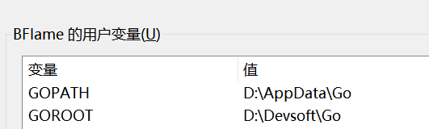

# Go语言配置


## 安装

在官网下载Go [https://golang.google.cn/dl/](https://golang.google.cn/dl/)

设置安装目录一路安装即可

## 配置环境变量

- 配置GOPATH和GOROOT

  其中GOPATH是存放Go的主要路径，

  - GOPATH/bin 存放Go install * 命令的文件，后续提到swagger会用到

  GOROOT是Go的根目录

  

并将$GOROOT/bin、$GOPATH/bin添加系统变量PATH：


现在即可以通过 `go version` 查看Go语言版本


### **推荐设置**

- Go env setting

  `go env -w GOPROXY=https://goproxy.cn,direct` 

  七牛设置的代理，设置后可大大提升安装包的速度！！！

- IDE配置

  主要有Goland和Vscode

  推荐使用vscode主要插件:Go , 使用后可自动删除未使用的import 并处理代码格式

  

  安装后可使用 `ctrl+shift+P`  输入从而更新包 当然也可以使用 `go get -u all` 来更新Go


## Hello，world！！

— 一切的开始

```go
package main

import "fmt"

func main() {
	fmt.Println("Hello, world")
}
```

使用 `go run main.go` (文件名） 即可运行，注意运行单文件的包名需要是main


好了，你已经会写 `hello, world` 了，那么现在来用Go语言完成本学习的学术分享平台吧！！！（×）

## Go web开发

主要使用Gin框架，下图是Go开发中主要的项目结构，不过多介绍了


PS 图来自《Go高级编程》 5.7 大型Web项目分层(侵删）

下面使用一个Gin的简单程序

```go
package main

import "github.com/gin-gonic/gin"

func main() {
	r := gin.Default()
	r.GET("/", func(c *gin.Context) {
		c.JSON(200, gin.H{
			"message": "success",
		})
	})
	r.Run(":8000")
}
```

如果项目中不存在 `go.mod` 文件需要使用 `go mod init` 生成mod文件，而后使用 `go mod tidy` 安装依赖。使用 `go run main.go` 运行即可，访问 `localhost:8000/` 查看到message 表示链接成功

好了，你已经真正的学会了如何用 `Gin` 开发Web程序，下面开始你的Go之旅吧！！


* **展望**（小声）

  后面可能会把Go配置Elastic Search的过程弄一下，以及在涉及到 Go处理并发时会出一下学习笔记

  

## 资料推荐

~~上面的在网上随便就能找来，没点自己的东西怎么行~~

本人也是才入门，好多东西都是边学边写，所以234参考都是目前写的时候参考的

1. GO语言圣经，入门语法必备：《Go程序设计语言》

2. 《Go语言实战》

3. 《Go Web编程》 基本覆盖开发需求：session，请求、数据库、部署。目前当做参考书来用

4. 《Go语言高级编程》 书的附录A中提到的Go常见坑很实用

   

### 参考

摘自[个人博客](https://blog.bflame.studio/2021/10/12/Introduction/Go-basic-intruduction/)

